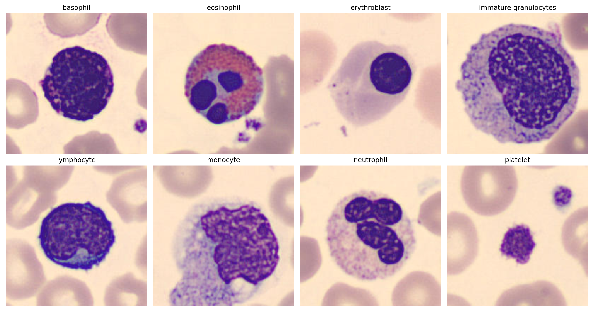

# Homework 1
[Codabench competition](https://www.codabench.org/competitions/4430/)

## Dataset

This dataset consists of images designed for the classification of different types of blood cells. Each image is labelled with one of eight classes, representing various blood cell types such as basophils, neutrophils, and lymphocytes. Here is an example of an image for each class:

### Dataset Details
* Image Size: 96x96
* Color Space: RGB (3 channels)
* Input Shape: (96, 96, 3)
* Number of Classes: 8

### Class Labels
0. Basophil
1. Eosinophil
2. Erythroblast
3. Immature granulocytes
4. Lymphocyte
5. Monocyte
6. Neutrophil
7. Platelet
