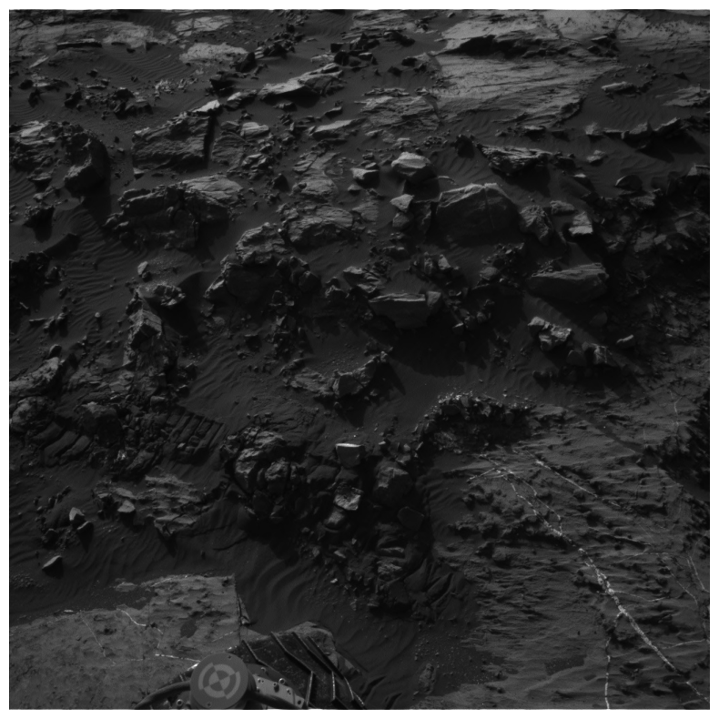
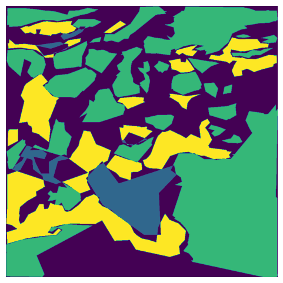

# Homework 2

[Kaggle competition]()

## Dataset
This dataset consists of segmented images from Mars terrain. Each image is paired with a mask representing the class of each pixel. Here is an example:

    
    

### Dataset Details
* Image Size: 64x128
* Color Space: Grayscale (1 channel)
* Input Shape: (64, 128)
* File Format: npz (Numpy archive)
* Number of Classes: 5

### Class Labels
* 0: Background
* 1: Soil
* 2: Bedrock
* 3: Sand
* 4: Big Rock
